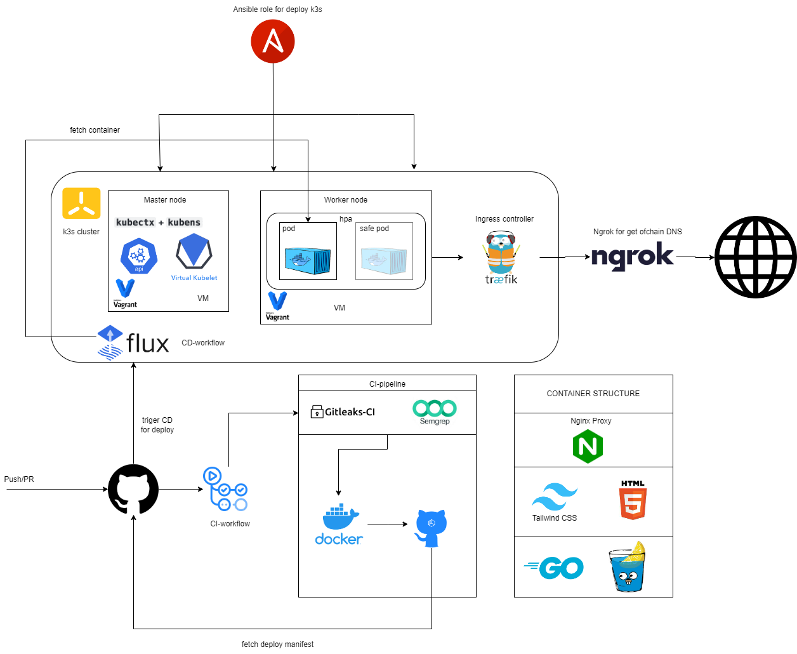
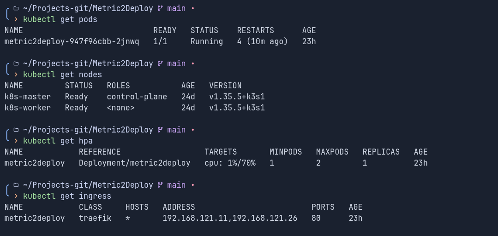

# GitOps Infrastructure

Prod-like GitOps and DevSecOps playground built around a lightweight `k3s` cluster, GitHub Actions pipelines, FluxCD image automation, and a single-container web application.



Mermaid source for the current architecture is available in [`img/diagram.mmd`](img/diagram.mmd).

## Overview

This repository demonstrates a full delivery loop for a small production-style platform:

- infrastructure provisioning with `Vagrant` and `libvirt`
- cluster bootstrap and host access with `Ansible`
- application packaging with `Docker`
- deployment to `k3s`
- GitOps reconciliation with `FluxCD`
- CI/CD automation with `GitHub Actions`
- security checks in the delivery pipeline

The demo application lives in `src/` and is implemented as a `Go` service with `Gin`, served behind `nginx` inside a single container image.

## Tech Stack

- `Go` + `Gin` for the application API and HTML rendering
- `nginx` as the in-container reverse proxy
- `Docker` for image build and packaging
- `k3s` as the target Kubernetes distribution
- `Traefik Ingress` for inbound traffic routing
- `HorizontalPodAutoscaler` for CPU-based scaling
- `FluxCD` for GitOps reconciliation
- `Ansible` for cluster bootstrap and kubeconfig setup
- `Vagrant` + `libvirt` for the local VM environment
- `GitHub Actions` for CI/CD and security automation

## Delivery Flow

1. A change is pushed to the repository.
2. GitHub Actions runs security checks.
3. The application image is built from `src/Dockerfile` and pushed to GHCR.
4. The deployment manifest image tag is updated automatically.
5. FluxCD reconciles the repository state into the `k3s` cluster.
6. Kubernetes rolls out the new container version.

## Quick Start

### 1. Start the VMs

```bash
cd ~/Projects-git/GitOps-infrastructure/Vagrant-k3s-cluster
vagrant up --provider=libvirt
vagrant status
```

### 2. Bootstrap the `k3s` cluster with Ansible

```bash
ansible-playbook -i ansible/inventory.ini ansible/k3s-claster.yml -v
```

### 3. Select the cluster context

```bash
unset KUBECONFIG
kubectl config get-contexts
kubectx metric2deploy
kubectl config set-context --current --namespace=default
```

### 4. Deploy the application manifests

```bash
kubectl apply -f k3s-manifest/
```

Or with an explicit kubeconfig:

```bash
KUBECONFIG=~/.kube/metric2deploy.yaml kubectl apply -f k3s-manifest/
```

### 5. Install FluxCD and apply GitOps resources

```bash
flux install
kubectl apply -f FluxCD/
kubectl get gitrepository,kustomization -n flux-system
```

### 6. Expose the environment with `ngrok`

```bash
ngrok http 192.168.121.11:80
```

## Screenshots



